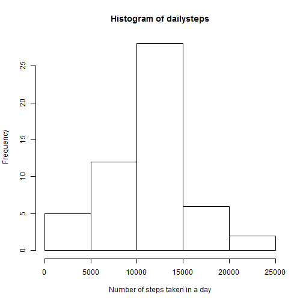
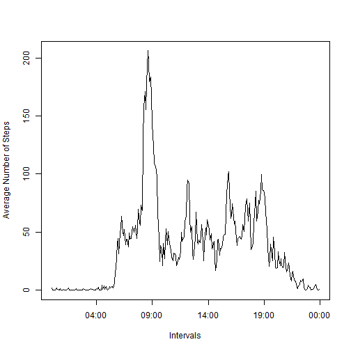
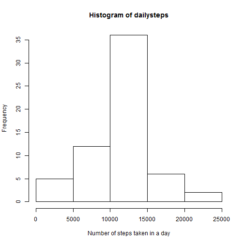
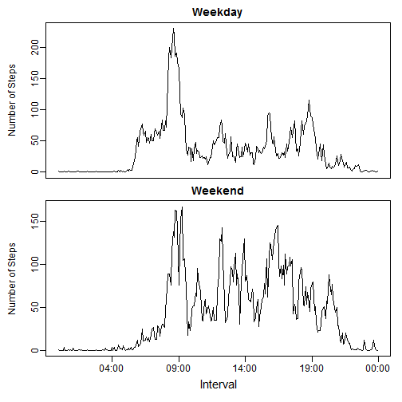

```r
options(scipen=1)
library(lattice)
```

## Loading and preprocessing the data

```r
unzip(zipfile = "activity.zip")
activity <- read.csv(file = "activity.csv")
```

***
## What is mean total number of steps taken per day?

```r
dailysteps <- tapply(activity$steps,activity$date,sum)
hist(dailysteps,xlab="Number of steps taken in a day")
```

 

```r
meansteps <- mean(dailysteps,na.rm=T)
medsteps <- median(dailysteps,na.rm=T)
```

The mean total number of steps taken per day is 10766.19

The median total number of steps taken per day is 10765

***
## What is the average daily activity pattern?

```r
intervalsteps <- tapply(activity$steps,activity$interval,mean,na.rm=T)
intervals <- unique(activity$interval)
s.intervals <- character(length(intervals))
for (i in 1:length(intervals)){
        s.intervals[i] <- paste(paste(rep(0,4-nchar(intervals[i])),collapse=""),
                                      intervals[i],sep="")
}
times <- strptime(s.intervals,"%H %M") 
plot(times,intervalsteps,type="l",xlab="Intervals",
     ylab="Average Number of Steps")
```

 

The 5-minute interval that contains the maximum number of steps on average is
08:35

***

## Imputing missing values

```r
na.count <- sum(is.na(activity$steps))
```
The total number of missing values (rows with NAs) is 2304

Replace missing values with the mean for that 5-minute interval

```r
newsteps <- activity$steps
for (i in 1:length(activity$steps)){
        if (is.na(activity$steps[i])){
                newsteps[i] <- intervalsteps[which(intervals==activity$interval[i])]
        }
}
newdata <- cbind(newsteps,activity[,2:3])
dailysteps <- tapply(newdata$newsteps,newdata$date,sum)
hist(dailysteps,xlab="Number of steps taken in a day")
```

 

```r
meansteps <- mean(dailysteps)
medsteps <- median(dailysteps)
```
The mean total number of steps taken per day is 10766.19

The median total number of steps taken per day is 10766.19

Imputing missing data doesn't affect the mean, but it does affect the median, 
bringing it to approximately the same value as the mean.

***
## Are there differences in activity patterns between weekdays and weekends?

```r
wkdays <- weekdays(as.Date(newdata$date))
daytype <- factor(ifelse(substr(wkdays,1,1)=="S","weekend","weekday"))
daytype.steps <- tapply(newdata$newsteps,list(newdata$interval,daytype),mean,na.rm=T)

par(mfrow=c(2,1),mar=c(0,4,2,1),oma=c(4,0,0,0),mgp=c(2.5,.5,0))
plot(times,daytype.steps[,1],type="l",xaxt="n",main="Weekday",xlab="",
     ylab="Number of Steps")
plot(times,daytype.steps[,2],type="l",main="Weekend",xlab="",
     ylab="Number of Steps")
mtext("Interval",side=1,outer=T,line=2,cex=1.25,adj=.55)
```

 
